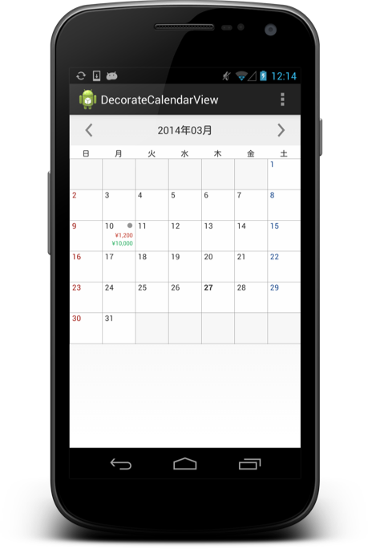

DecorateCalendarView
====================

[](https://travis-ci.org/zaiminc/DecorateCalendarView)

Simple customizable calendar view for Android.




Usage
-----

### Implementation

Include `DecorateCalendarView` in your layout XML.

```xml
<net.zaim.decoratecalendarview.DecorateCalendarView
    android:id="@+id/my_calendar"
    android:layout_width="match_parent"
    android:layout_height="wrap_content" />
```

In the `onCreate` of your activity or the `onCreateView` of your fragment, set the view with valid date.

```java
public class MainActivity extends FragmentActivity {

    @Override
    protected void onCreate(Bundle savedInstanceState) {
        super.onCreate(savedInstanceState);
        setContentView(R.layout.activity_main);

        DecorateCalendarView calendarView = (DecorateCalendarView) findViewById(R.id.my_calendar);
        calendarView.initCalendar(getSupportFragmentManager(), null);
    }
```

### Customize

The default display is as below:

* Biginning week of day: Sunday
* Holiday highlight: Date text
* Background color of selected cell: none

If you want to customize, set parameter to `initCalendar(FragmentManager, Bundle)` method.

```java
DecorateCalendarView calendarView = (DecorateCalendarView) findViewById(R.id.my_calendar);
Bundle bundle = new Bundle();

// Custom calendar view
bundle.putString(DecorateCalendarView.BUNDLE_KEY_BEGINNING_DAY_OF_WEEK, String.valueOf(Calendar.MONDAY));
bundle.putString(DecorateCalendarView.BUNDLE_KEY_HOLIDAY_HIGHLIGHT_TYPE, String.valueOf(DecorateCalendarView.HOLIDAY_HIGHLIGHT_TYPE_BACKGROUND));
bundle.putString(DecorateCalendarView.BUNDLE_KEY_SELECTED_COLOR, String.valueOf(Color.parseColor("555555")));
```

### Event listener

This calendar provide event listener as below.

* When tap date
* When changed month

```java
DecorateCalendarView calendarView = (DecorateCalendarView) findViewById(R.id.my_calendar);
// Set event listener from calendar view
calendarView.setOnDecorateCalendarListener(this);

@Override
public void onDayClick(Date day) {}

@Override
public void onChangeDisplayMonth(Date date) {}
```

Download
-----

Download via gradle.

```groovy
repositories {
    mavenCentral()
}

dependecies {
    compile 'net.zaim.android:decoratecalendarview:0.2.1`
}
```

License
-----


    Copyright 2014 Zaim, Inc.

    Licensed under the Apache License, Version 2.0 (the "License");
    you may not use this file except in compliance with the License.
    You may obtain a copy of the License at

       http://www.apache.org/licenses/LICENSE-2.0

    Unless required by applicable law or agreed to in writing, software
    distributed under the License is distributed on an "AS IS" BASIS,
    WITHOUT WARRANTIES OR CONDITIONS OF ANY KIND, either express or implied.
    See the License for the specific language governing permissions and
    limitations under the License.
